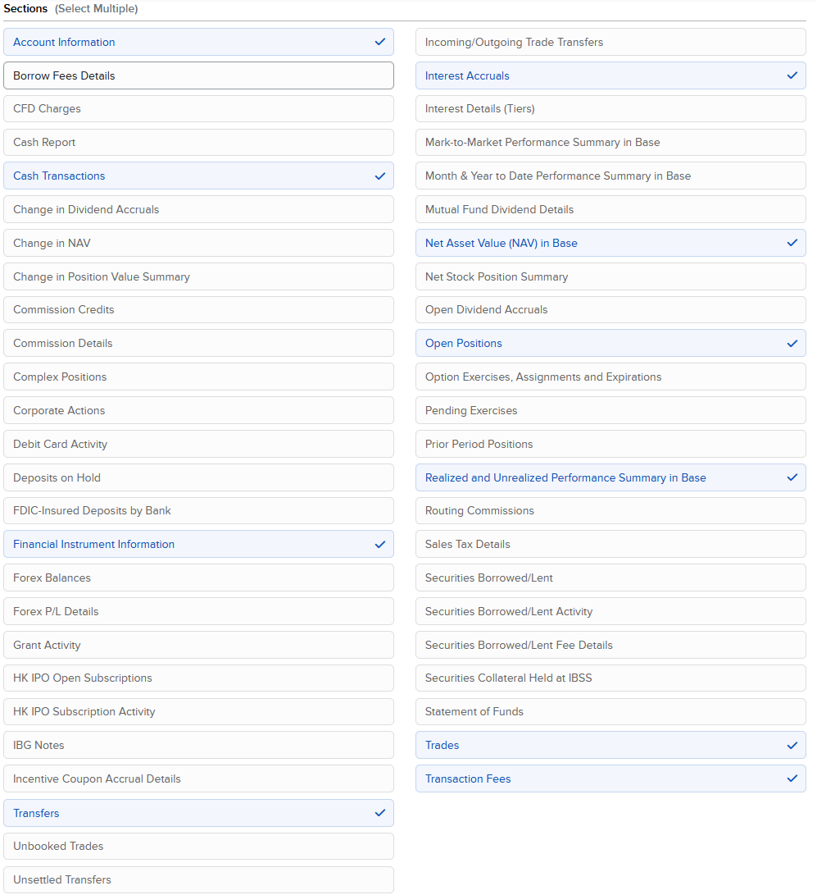
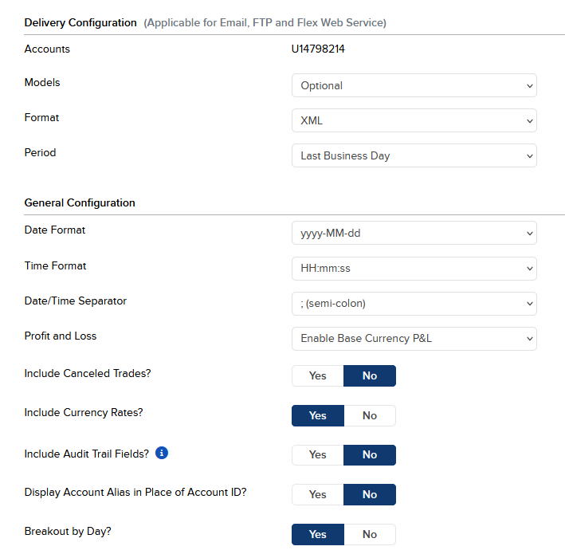
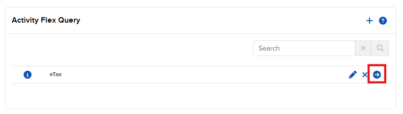
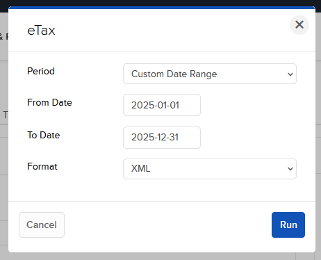

# ibkr-to-etax

Convert Interactive Brokers (IBKR) XML exports to Swiss eCH-0196 electronic tax statements with PDF417 barcodes.

**DISCLAIMER**
You are fully responsible to validate the data together with the official statement from IBKR. This tool is

## Features

### Convert IBKR to eCH-0196
- Parses IBKR FlexQuery XML exports
- Converts positions, trades, dividends, and withholding tax to eCH-0196 format
- Generates XML compliant with eCH-0196-2-2 standard
- Displays comprehensive financial summary

### ⚠️not fully working yet ⚠️
- Creates PDF with PDF417 and CODE128C barcodes as per eCH-0196 specification

### Validate eCH-0196 PDFs
- Validates CODE128C barcodes on each page
- Extracts and validates PDF417 barcodes
- Decompresses embedded GZIP XML data
- Validates XML structure and namespace
- Optional XSD schema validation
- Extracts and displays tax statement summary


## Building

### Prerequisites
- .NET 9.0 SDK or later

Installation:

```powershell
winget install Microsoft.DotNet.SDK.9
```

### Build
```bash
dotnet build -c Release
```

## Usage

## IBKR Setup

### Setup Flex Query

In the Portal, go to (Performance & Reports -> Flex Queries)[https://www.interactivebrokers.co.uk/AccountManagement/AmAuthentication?action=RM_FLEX_QUERIES]

Click on +


* Set a Query Name (e.g. "eTax")
* Select all the following Sections. Always choose "Select All" for the columns.

  * **Account Information**: Select All Columns
  * **Cash Transactions**: Options: Dividends, Withholding Tax, 871(m) Withholding, Broker Fees, Deposits & Withdrawals, Select all Columns
    
  * **Interest Accruals**: Select all Columns
  * **Net Asset Value (NAV) in Base**: Select all Columns
  * **Open Positions**: Select "Summary" and all Columns
    
  * **Realized and Unrealized Performance Summary in Base**: Select all Columns
  * **Trades**: Select all Columns
* **Delivery Configuration**
  

* Press **Continue**
* Press **Save Changes**
* Press **OK**

### Run Flex Query

In the Activity Flex Query Overview, run the newly created flexquery:


Fill out the form:

* **Period**: Custom Date Range
* **From Date**: 01-Jan (of Tax Year)
* **To Date**: 31-Dec (of Tax Year)
* **Format**: XML

Click **Run**

## Convert XML to eCH 8


### Convert IBKR XML to eCH-0196
```bash
# Using explicit command
dotnet run -- convert eTax.xml

# Or run the executable directly
./bin/Release/net9.0/ibkr-to-etax convert eTax.xml
```

This will generate:
- `eCH-0196-output.xml` - eCH-0196 compliant XML
- `eCH-0196-output.pdf` - PDF with embedded barcodes

### Validate eCH-0196 PDF
```bash
# Basic validation
dotnet run -- validate eCH-0196-output.pdf

# With XSD schema validation
dotnet run -- validate eCH-0196-output.pdf --schema eCH-0196-2-2.xsd
dotnet run -- validate eCH-0196-output.pdf -s eCH-0196-2-2.xsd
```

This will:
- Validate all barcodes
- Extract embedded XML
- Display tax statement summary
- Save extracted XML to `[filename]-extracted.xml`

### Sign XML Document
```bash
# Sign an XML file with a digital certificate
dotnet run -- sign eCH-0196-output.xml --cert certificate.pfx --password "your-password"
dotnet run -- sign eCH-0196-output.xml -c certificate.pfx -p "your-password"
```

This will:
- Sign the XML with XMLDSig signature
- Embed the certificate's public key
- Add signature to the XML document

**Creating a test certificate** (PowerShell):
```powershell
New-SelfSignedCertificate -DnsName "Test Certificate" `
  -CertStoreLocation "Cert:\CurrentUser\My" `
  -KeyExportPolicy Exportable `
  -KeySpec Signature `
  -KeyLength 2048 `
  -KeyAlgorithm RSA `
  -HashAlgorithm SHA256 `
  -Subject "CN=Test XML Signer" |
  Export-PfxCertificate -FilePath ".\certificate.pfx" `
  -Password (ConvertTo-SecureString -String "test123" -Force -AsPlainText)
```

### Verify XML Signature
```bash
# Verify the digital signature on a signed XML file
dotnet run -- verify eCH-0196-output.xml
```

This will:
- Validate the XMLDSig signature
- Check signature integrity
- Display verification result

### Help
```bash
dotnet run -- --help
dotnet run -- convert --help
dotnet run -- validate --help
dotnet run -- sign --help
dotnet run -- verify --help
```

## Project Structure

```
├── main.cs                      # Entry point with CLI commands
├── IbkrDataParser.cs           # IBKR XML parsing
├── EchStatementBuilder.cs      # eCH-0196 statement builder
├── EchXmlGenerator.cs          # XML generation
├── FinancialSummaryPrinter.cs  # Financial reporting
├── PdfBarcodeGenerator.cs      # PDF with barcodes generation
├── PdfValidator.cs             # PDF validation and extraction
├── DataHelper.cs               # Utility functions
└── Ech*.cs                     # eCH-0196 data models
```

## Dependencies

- **CommandLineParser** - Command-line argument parsing
- **iText7** - PDF generation and parsing
- **ZXing.Net.Bindings.SkiaSharp** - Barcode generation and reading
- **SkiaSharp** - Image processing

## License

This program is free software; you can redistribute it and/or modify it under the terms of the GNU General Public License as published by the Free Software Foundation; either version 2 of the License, or (at your option) any later version.

This program is distributed in the hope that it will be useful, but WITHOUT ANY WARRANTY; without even the implied warranty of MERCHANTABILITY or FITNESS FOR A PARTICULAR PURPOSE. See the GNU General Public License for more details.

You should have received a copy of the GNU General Public License along with this program; if not, write to the Free Software Foundation, Inc., 51 Franklin Street, Fifth Floor, Boston, MA 02110-1301, USA.

See [LICENSE](LICENSE) for full license text.

## References

- [eCH-0196 Standard](https://www.ech.ch/de/ech/ech-0196)
- [Interactive Brokers](https://www.interactivebrokers.com/)
