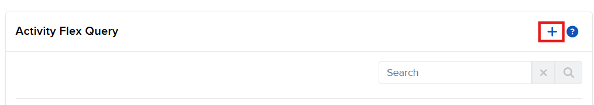
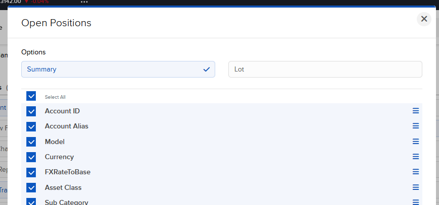
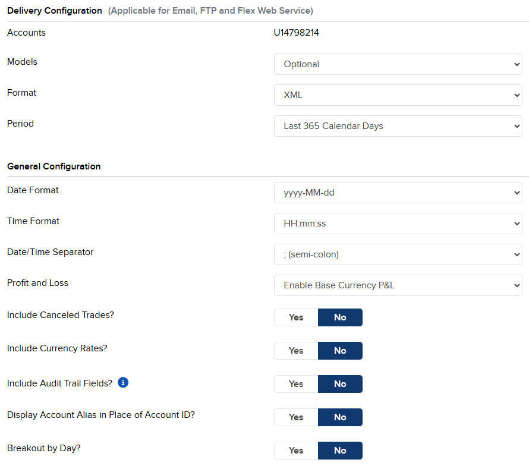
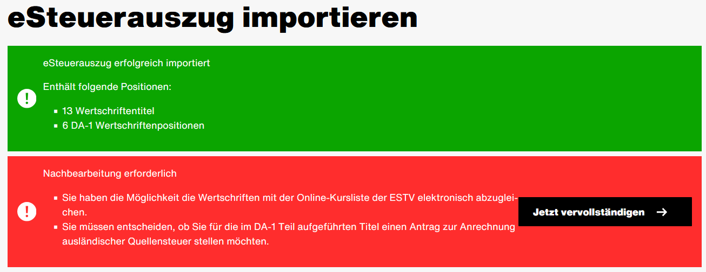
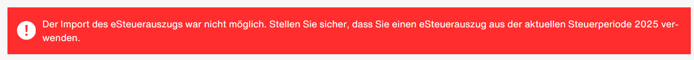

# ibkr-to-etax

> **Automate your Swiss tax filing**: Convert Interactive Brokers trading data to eCH-0196 compliant tax statements.

Simplify your Swiss tax declaration by automatically converting Interactive Brokers (IBKR) FlexQuery exports into eCH-0196 electronic tax statements compatible with Swiss cantonal tax systems.

## 📋 Table of Contents

- [Features](#features)
- [Quick Start](#quick-start)
- [IBKR Setup Guide](#ibkr-setup-guide)
- [Usage](#usage)
- [Project Structure](#project-structure)
- [License](#license)

## ⚠️ Important Disclaimer

**This tool is provided "as-is" without warranty of any kind.** You are solely responsible for:
- Verifying all generated data against official IBKR statements
- Ensuring accuracy of your tax declaration
- Complying with Swiss tax regulations

Always cross-check the output before submitting to tax authorities.

## ✨ Features

### 🔄 IBKR to eCH-0196 Conversion
- ✅ Parses IBKR FlexQuery XML exports automatically
- ✅ Converts securities positions, trades, dividends, and withholding taxes
- ✅ Generates eCH-0196-2-2 compliant XML for direct upload
- ✅ Correctly allocates Swiss (GrossRevenueA) vs Foreign (GrossRevenueB) dividends
- ✅ Calculates additional US withholding tax (15% treaty rate)
- ✅ Displays comprehensive financial summary

### 📊 What Gets Converted
- **Securities positions** with year-end valuations (NAV)
- **Stock trades** (buy/sell transactions)
- **Dividend payments** with proper tax allocation
- **Withholding tax** claims
- **Cash balances** at year-end

### 🔍 PDF Validation (Experimental)
- Validates CODE128C and PDF417 barcodes
- Extracts embedded XML from eCH-0196 PDFs
- Decompresses zlib/DEFLATE compressed data
- XSD schema validation support

> **Note:** PDF generation with barcodes is experimental and not required for tax filing. XML upload is the recommended method.

## 🚀 Quick Start

### 1. Install Prerequisites

Ensure you have .NET 9.0 SDK installed:

```powershell
winget install Microsoft.DotNet.SDK.9
```

### 2. Build the Project

```bash
git clone https://github.com/aurelschwitter/ibkr-to-etax.git
cd ibkr-to-etax
dotnet build -c Release
```

### 3. Export Data from IBKR

Follow the [IBKR Setup Guide](#ibkr-setup-guide) below to configure and run your FlexQuery.

### 4. Convert to eCH-0196

```powershell
dotnet run -- convert .\input\YourIBKRExport.xml
```

This generates:
- `YourIBKRExport.output.xml` - Upload this to your cantonal tax portal
- `YourIBKRExport.output.pdf` - PDF with embedded data (experimental)

### 5. Upload to Tax System

Upload the generated XML file to your cantonal online tax portal (e.g., ZH eTax).

## 📖 IBKR Setup Guide

### Step 1: Create a FlexQuery

1. Log in to IBKR Account Management
2. Navigate to **Performance & Reports → [Flex Queries](https://www.interactivebrokers.co.uk/AccountManagement/AmAuthentication?action=RM_FLEX_QUERIES)**
3. Click the **+** button to create a new Activity Flex Query



### Step 2: Configure Query Settings

**Query Name:** Choose a descriptive name (e.g., "Swiss Tax 2024")

**Select the following sections** (always choose "Select All" for columns):


| Section                                                 | Configuration                                                                                                        |
| ------------------------------------------------------- | -------------------------------------------------------------------------------------------------------------------- |
| **Account Information**                                 | Select All Columns                                                                                                   |
| **Cash Transactions**                                   | **Types**: Dividends, Withholding Tax, 871(m) Withholding, Broker Fees, Deposits & Withdrawals<br>Select All Columns |
| **Interest Accruals**                                   | Select All Columns                                                                                                   |
| **Net Asset Value (NAV) in Base**                       | Select All Columns                                                                                                   |
| **Open Positions**                                      | Detail Level: **Summary**<br>Select All Columns                                                                      |
| **Realized and Unrealized Performance Summary in Base** | Select All Columns                                                                                                   |
| **Trades**                                              | Select All Columns                                                                                                   |

<details>
<summary>📸 View detailed screenshots</summary>

**Cash Transactions Configuration:**


**Open Positions Configuration:**


</details>

Configure **Delivery Configuration**:



### Step 3: Save the Query

1. Click **Continue**
2. Click **Save Changes**
3. Click **OK**

### Step 4: Run the FlexQuery

1. In the Flex Query overview, click the **▶ Run** button for your query


2. Configure the query parameters:


| Parameter     | Value                                |
| ------------- | ------------------------------------ |
| **Period**    | Custom Date Range                    |
| **From Date** | 01-Jan-{TaxYear} (e.g., 01-Jan-2024) |
| **To Date**   | 31-Dec-{TaxYear} (e.g., 31-Dec-2024) |
| **Format**    | XML                                  |

3. Click **Run** and download the generated XML file

## 💻 Usage

### Convert IBKR Export to eCH-0196

```powershell
# Basic conversion
dotnet run -- convert .\input\YourFile.xml
```

**Output:**
- `YourFile.output.xml` - eCH-0196 compliant XML (ready for upload)
- `YourFile.output.pdf` - PDF with embedded barcodes (experimental)

### Functions available for debugging

Generate PDF directly from XML:
```powershell
dotnet run -- genpdf .\input\eCH-0196-statement.xml .\output\result.pdf
```

Read and Validate Data from existing PDF:
```powershell
dotnet run -- validate .\input\SomePDF.pdf
```
-> Validates barcode structure, extracts embedded XML, and displays tax statement summary.


## 📤 Uploading to Tax System

### Zurich (ZH) Canton Example

1. Navigate to your tax declaration
3. Find the securities declaration section
4. Select "eSteuerauszug importieren"
5. Upload the generated `.output.xml` file
6. Verify the imported data matches your IBKR statements

✅ **Success!** The system will import your securities, trades, and dividends automatically.



> **Note:** Different cantons may have slightly different upload processes. Consult your canton's tax portal documentation.

## 📊 Output Example

The tool provides detailed financial summaries during conversion:

```
=== FINANCIAL SUMMARY ===

Dividends + Withholding Tax per Currency:
  CHF: Dividends: 1234.56, Tax: 123.45, Gross: 1111.11
  USD: Dividends: 1234.56, Tax: 123.45, Gross: 1111.11

Total Dividends in CHF: 2500.12
Total Withholding Tax in CHF: 250.12

✓ Generated eCH-0196 tax statement: output.xml
  - 19 securities
  - 93 stock mutations (trades)
  - 22 dividend payments
```

## 🏗️ Project Structure

```bash
src/
├── main.cs                     # CLI entry point & command handling
├── IbkrDataParser.cs           # IBKR FlexQuery XML parser
├── EchStatementBuilder.cs      # eCH-0196 statement construction
├── EchXmlGenerator.cs          # eCH-0196 XML serialization
├── FinancialSummaryPrinter.cs  # Financial reports & summaries
├── PdfBarcodeGenerator.cs      # PDF417/CODE128C barcode generation
├── PdfValidator.cs             # PDF validation & barcode extraction
├── DataHelper.cs               # Currency conversion & formatting utilities
└── Ech*.cs                     # eCH-0196 data model classes

schemas/
└── eCH-0196-2-2.xsd            # eCH-0196 XML schema for validation

tests/
└── *.Tests.cs                  # Unit & integration tests
```

## 🔧 Dependencies

| Package                          | Purpose                       |
| -------------------------------- | ----------------------------- |
| **CommandLineParser**            | CLI argument parsing          |
| **iText7**                       | PDF generation & manipulation |
| **ZXing.Net.Bindings.SkiaSharp** | Barcode generation & scanning |
| **SkiaSharp**                    | Image processing              |
| **SharpCompress**                | zlib/DEFLATE compression      |

## 🤝 Contributing

Contributions are welcome! Areas where help is needed:

- **PDF Barcode Generation**: Change the PDF comply with the cantonal tax systems:
- 
- **Additional Cantons**: Testing with other cantonal tax systems
- **Documentation**: Improving setup guides and examples
- **Testing**: More unit tests and edge case coverage

## 📝 License

This program is free software licensed under **GNU General Public License v2.0 (GPLv2)**.

You may redistribute and/or modify it under the terms of the GNU General Public License as published by the Free Software Foundation; either version 2 of the License, or (at your option) any later version.

This program is distributed WITHOUT ANY WARRANTY; without even the implied warranty of MERCHANTABILITY or FITNESS FOR A PARTICULAR PURPOSE. See the [LICENSE](LICENSE) file for full details.

## 📚 References & Standards

- **[eCH-0196 Standard](https://www.ech.ch/de/ech/ech-0196)** - Swiss e-government standard for securities tax statements
- **[eCH-0270 Standard](https://www.ech.ch/de/ech/ech-0270)** - PDF417 barcode specifications
- **[Interactive Brokers](https://www.interactivebrokers.com/)** - IBKR official website
- **[IBKR FlexQuery Guide](https://www.interactivebrokers.com/en/software/reportguide/reportguide.htm)** - FlexQuery documentation


---

**Made in 🇨🇭 for Swiss taxpayers** | [Report Issues](../../issues) | [Contribute](../../pulls)
